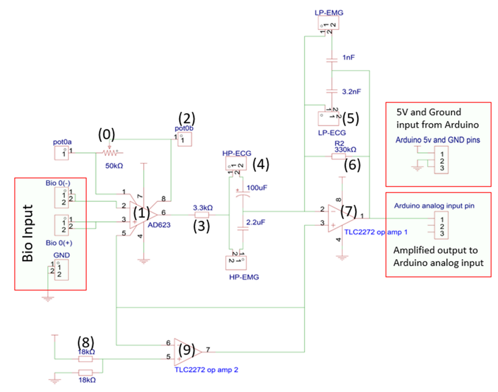
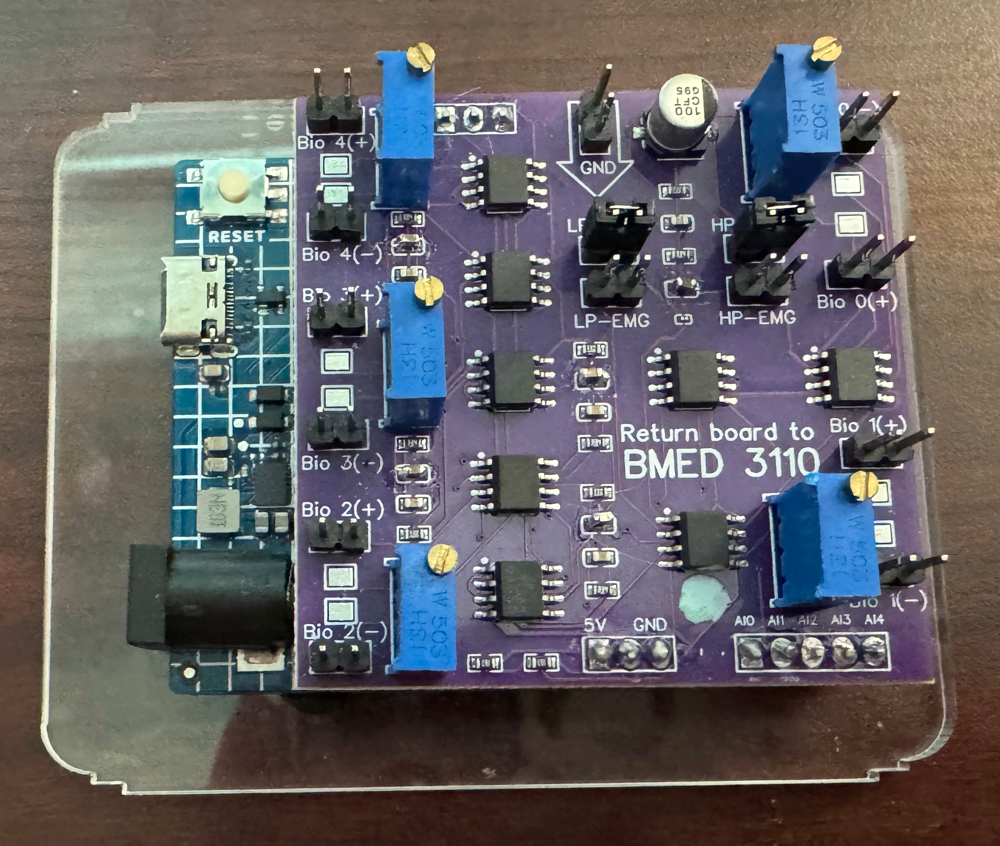
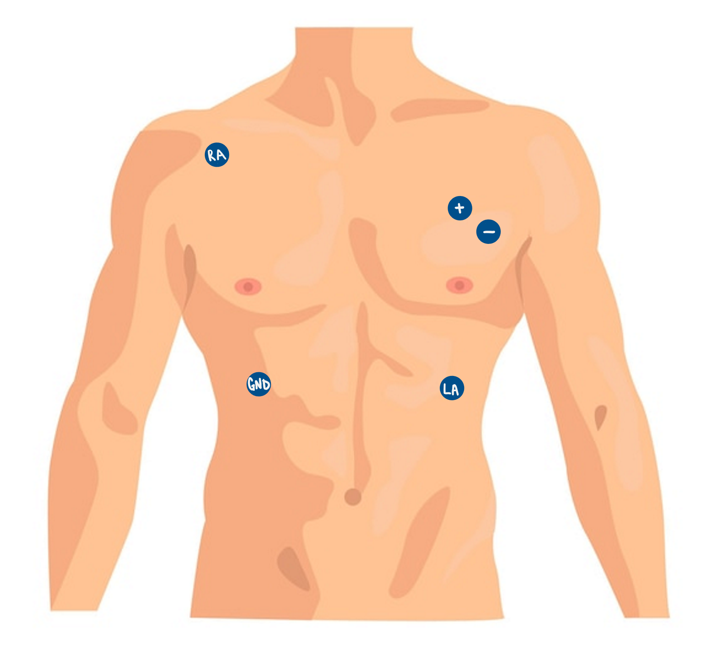

# **Validation & Testing**

## Overview

## (i) Hardware & Circuit Configuration

A bioamplifier circuit and Arduino Uno were borrowed from the Georgia Tech Library for obtaining the experimental ECG and sEMG signals. The board provided 5V power and analog-to-digital conversion at 1200 Hz. Electrode connections were made using alligator clips with Bio(0)- and Bio(0)+ carrying the ECG signal and Bio(1)- and Bio(1)+ carrying the sEMG reference signal. The two channels simultaneously recorded both signals allowing for adaptive noise cancellation. 

Schematic provided by Georgia Tech BMED 3110.

**AD623 Instrumentation Amplifier - Stage (1)**
The AD623 amplifies the difference between the two input electrodes and uses common-mode reject to cancel any signals common to both such as a powerline interference. This common-mode rejection is the same principle as what is used in bipolar pacemaker leads.

**Gain Stage - Stage (0)**
The gain stage is set by the 100kOhm potentiometer which amplifies approximately 3 times since ECG signals at the surface are typically relatively low voltage.

**High Pass Filter - Stages (3) and (4)**
The high pass filter removes any low voltage disturbances such as breathing or electrode movement. This is crucial since any drift could reduce the accuracy of the adaptive noise cancellation filter.

**Low Pass Filter - Stage (5)**
This stage allows the two channels to split. LP-ECG limits the ECG signal to the standard cardiac band while LP-EMG keeps the higher frequencies to determine the muscle artifact.

**Virtual Ground - Stages (8) and (9)**
These stages use a voltage divider to set a baseline for the signal. This moves the zero of the signal up to 2.5V to avoid any lost signal from the Arduino being unable to read below zero.

**Output Buffer - Stage (7)**
This final stage buffers the signal for the last time and outputs it to the Arduino analog input pin.

## (ii) Electrode Placement

**Electrode Placement for ECG**
I had previously learned an electrode configuration for ECG in which the two working electrodes were placed below each clavicle and the third electrode was grounded on the hip bone. However, this setup quickly failed for this work since this resulted in the electrodes running in the same direction as the pectoral muscle fibers. This led to inflation of the T wave which not only led to a incorrectly shaped signal but also incorrect peak detection in the QRS-gating. 
The new electrode placement I determined is the right side electrode in the same place as before (below the right clavicle) but a change in the position of the left electrode. The left electrode should be roughly in the V5 region as to not be on the pectoral muscle or run laterally with the direction of the muscle fibers. Additionally, the ground electrode would be placed at the bottom of the right rib cage instead of all the way below by the hip.

**Electrode Placement for EMG**
Originally, I placed the electrodes horizontally to align with the sternal head of the pectoralis major muscle fibers, but my electrodes were actually placed higher than the sternal head. Because the best electrical signal conduction occurs when electrodes are in the same direction as the muscle fibers, this configuration didn't work well. To adjust, I then placed the electrodes running diagonally once I found out they were actually on the clavicular head of the pectoralis major. This yielded a much better resulting signal.

## (iii) Signal Acquisition & Code Changes

## (iv) Validation Results

## (v) Reflection
